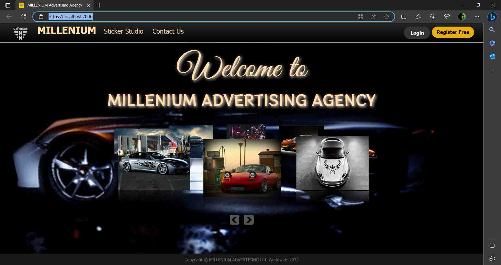
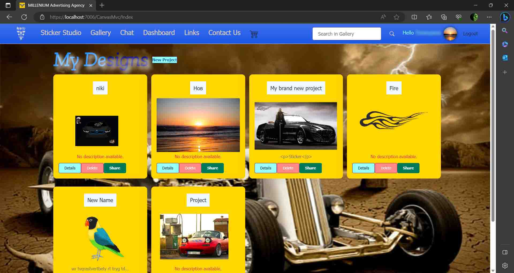
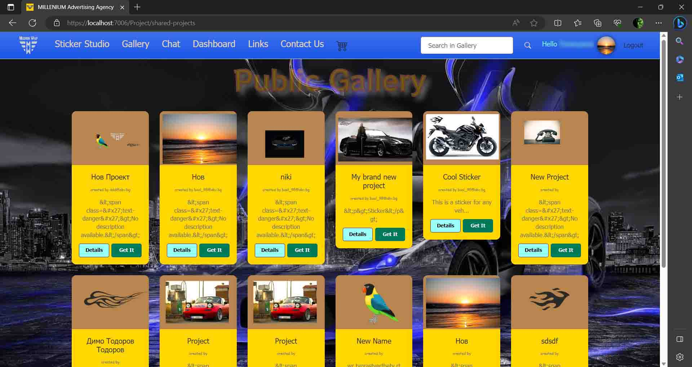
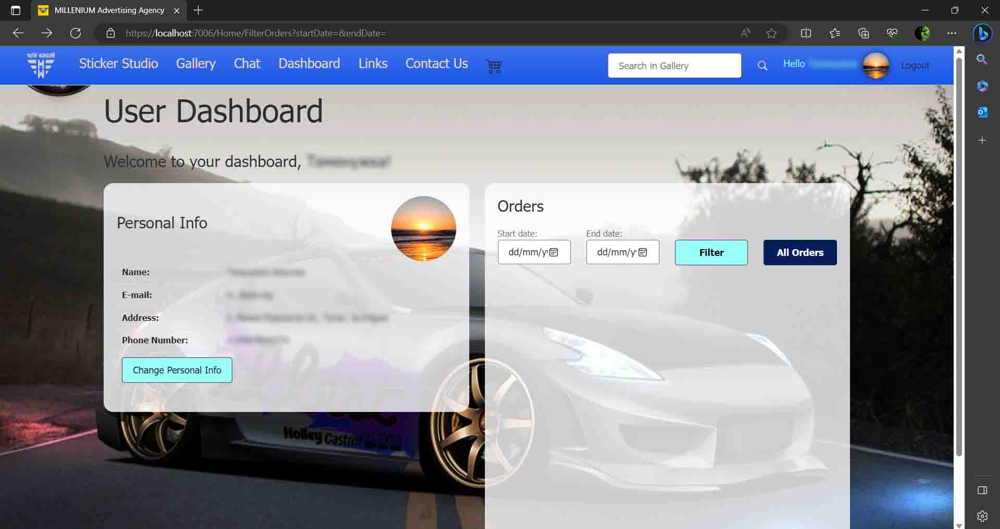
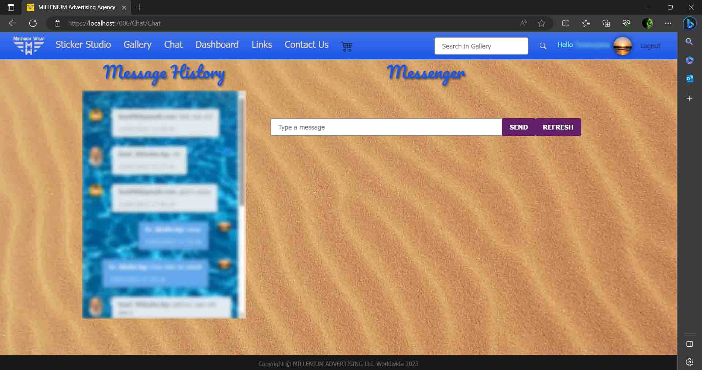
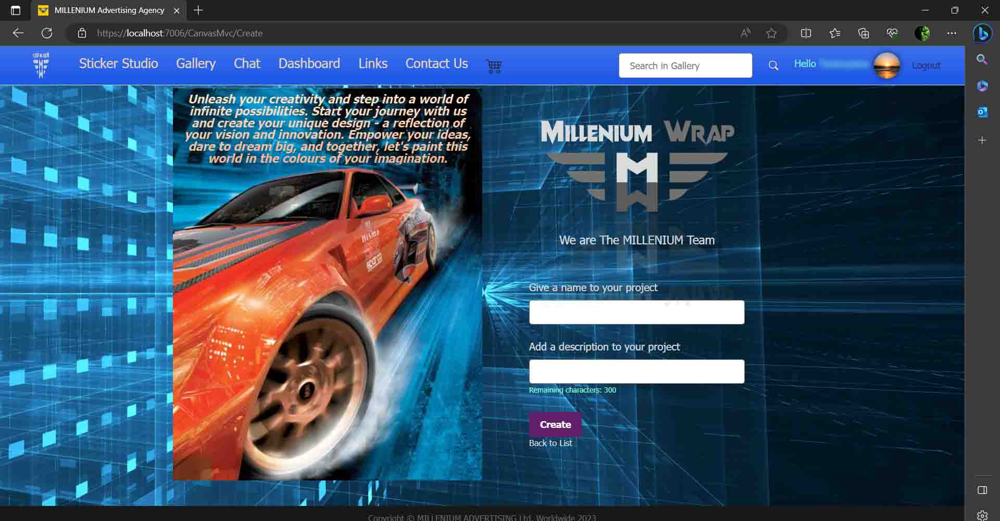
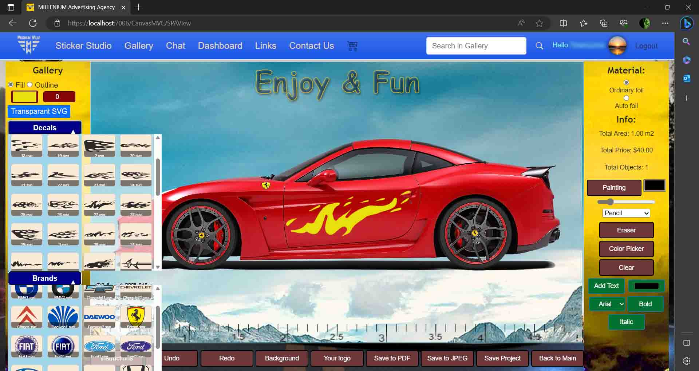
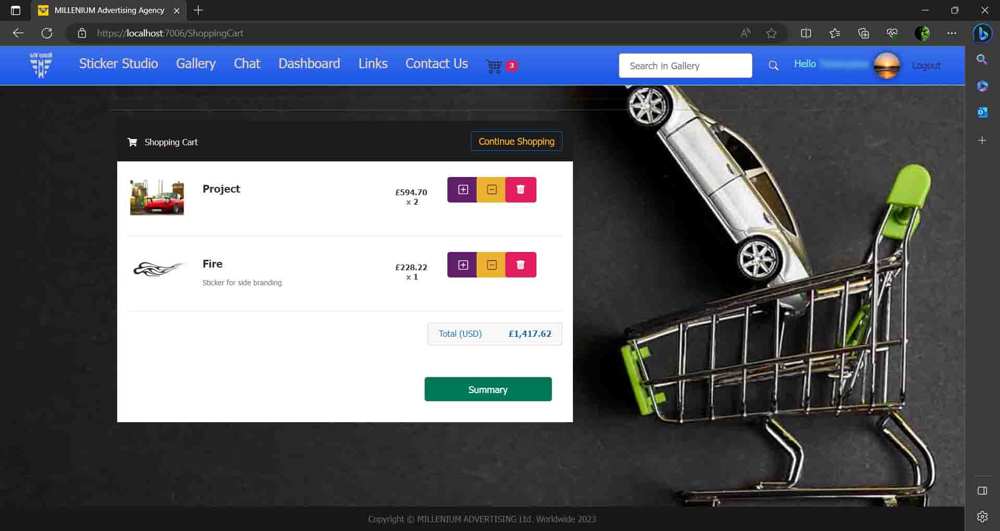
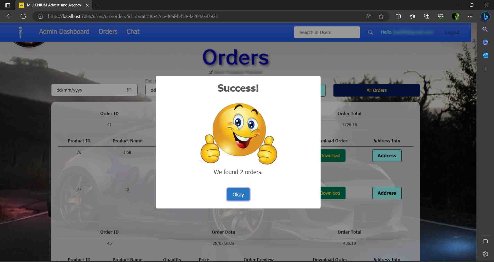
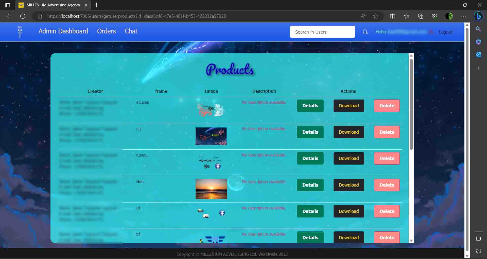

# Vehicle Sticker Designer

Vehicle Sticker Designer is a Single Page Application (SPA) that enables users to create and edit unique stickers for vehicles. It is crafted with ASP.NET MVC and offers a wide variety of features, including customizable templates, real-time collaboration, and administrative controls.

The project is now live and can be viewed at:

[https://milleniumwrap.com/](https://milleniumwrap.com/)

[https://milleniumwrap.azurewebsites.net/](https://milleniumwrap.azurewebsites.net/)


## Table of Contents

- [Vehicle Sticker Designer](#vehicle-sticker-designer)
  - [Table of Contents](#table-of-contents)
  - [Features](#features)
    - [User Experience](#user-experience)
    - [Admin Panel (See Admin Panel for more details)](#admin-panel-see-admin-panel-for-more-details)
  - [Technologies](#technologies)
  - [Admin Panel](#admin-panel)
    - [Features](#features-1)
  - [Screenshots](#screenshots)
    - [Welcome Page](#welcome-page)
    - [User Gallery](#user-gallery)
    - [Public Gallery](#public-gallery)
    - [User Dashboard](#user-dashboard)
    - [Chat](#chat)
    - [Create Project Window](#create-project-window)
    - [SPA Application](#spa-application)
    - [Shopping Cart](#shopping-cart)
    - [Admin - User Orders](#admin---user-orders)
    - [Admin - User Products](#admin---user-products)
  - [Testing](#testing)
  - [Getting Started](#getting-started)
    - [Prerequisites](#prerequisites)
    - [Installation](#installation)
  - [Contributing](#contributing)
  - [License](#license)

## Features

### User Experience

- **Project Management:** Users can create and edit their projects after registration via Facebook or standard methods. Projects can be named and described for future searching.
- **Template Library:** Offers ready-to-use stickers in SVG and PNG formats. SVG stickers can be colored with a user-defined palette, and outlines can be customized.
- **Sticker Customization:** Users can resize, rotate, and flip stickers, change their color, or make them transparent.
- **Background Images:** Users can set custom vehicle images as backgrounds, defining real-world scales for accurate sticker placement.
- **Price Information:** Displays the size and price of individual stickers and the total cost based on material selection.
- **Export & Save:** Projects can be saved locally or to a database, shared in a public gallery, or added to the user's shopping cart.
- **Search & Share:** Users can search shared projects by keywords and use or share them in their gallery.
- **Chat Feature:** Real-time chat with other users, implemented using SignalR.
- **Shopping Cart:** Users can add and remove products, with proper profile completion required for checkout. Personal data can be edited in compliance with GDPR, and Azure Blob service is used for profile images. Phone verification is done through Twilio API.

### Admin Panel (See [Admin Panel](#admin-panel) for more details)

- User and order management, product extraction, real-time data handling, and chat communication with users.

## Technologies

- ASP.NET Core MVC
- ASP Net Entity Framework
- SQL Server
- JavaScript
- CSS
- SignalR
- Twilio
- Azure Blob
- Facebook API

## Admin Panel

### Features

- **User Role Management:** Admins can toggle user roles between administrators and standard users.
- **Profile Oversight:** View user profiles, orders, and products for proper management.
- **Product Extraction:** Extract products from orders with individual or group reports for specific periods.
- **Real-Time Data Handling:** Retrieve real-time sizes and formats of user products for easier processing.
- **Chat Communication:** Communicate with users via chat.

## Screenshots

Below are some key screenshots that highlight various features and aspects of the Vehicle Sticker Designer application.

### Welcome Page


### User Gallery


### Public Gallery


### User Dashboard


### Chat


### Create Project Window


### SPA Application


### Shopping Cart


### Admin - User Orders


### Admin - User Products


## Testing

The application is covered by NUnit tests, covering over 85% of the business logic.

## Getting Started

These instructions will guide you through the process of setting up and running the Vehicle Sticker Designer on your local machine.

### Prerequisites

- .NET Core SDK
- SQL Server (or your preferred database system)
- Node.js (for client-side dependencies)

### Installation

1. **Clone the repository:** 
   ```
   git clone https://github.com/baal98/Advertising-Agency
   ```

2. **Navigate to the project directory:**
   ```
   cd vehicle-sticker-designer
   ```

3. **Restore NuGet packages:**
   ```
   dotnet restore
   ```

4. **Set up the database:**
    ```
   update Migrations
   ```

5. **Build and run the project:**
   ```
   dotnet build
   dotnet run
   ```

6. Open your browser and navigate to `http://localhost:5000` or the port you have configured.

## Contributing

Contributions are welcome! If you would like to contribute to the Vehicle Sticker Designer, please follow these steps:

1. **Fork the repository.**
2. **Create a new branch:** `git checkout -b feature/my-new-feature`
3. **Make your changes and commit them:** `git commit -am 'Add my new feature'`
4. **Push to your branch:** `git push origin feature/my-new-feature`
5. **Submit a pull request.**

Please make sure to update tests as appropriate and follow the coding standards of the project.

## License

Vehicle Sticker Designer is licensed under the MIT License. See the [LICENSE](LICENSE) file for more details.
